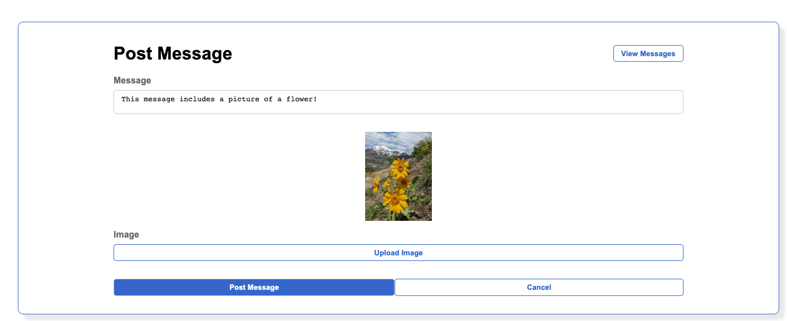
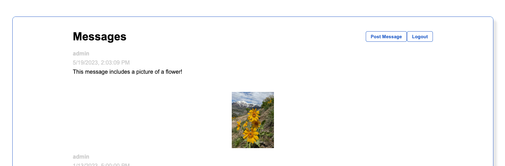

# Persisty Data Example App : messenger

In [the example bundled with persisty](https://github.com/tofarr/persisty/examples/messenger_5), we created an
application to allow users to post messages to a board. This example adds the ability to upload an image to be
associated with each message. As previously, this code is compatible with both an AWS Lambda Environment (Using S3)
and a hosted environment. For a lambda deployment using S3, you will need to choose a universally unique bucket name.
If you do not specify this in your environment, persisty-data will fall back to using your default persistence mechanism
(In this case dynamodb) to store your data in a chunked format. (Obviously there are performance and cost implications
to this)

## Running the Code

* Clone the git repo `git clone https://github.com/tofarr/persisty-data.git`
* Go to the directory `cd persisty-data/examples/messenger_6`
* Create a virtual environment. (I used [virtualenvwrapper](https://virtualenvwrapper.readthedocs.io/en/latest/)
  for this)
  * `pip install virtualenvwrapper`
  * `mkvirtualenv messenger_6`
  * `workon messenger_6`
* Install requirements with `pip install -r requirments.txt`
* Run locally with `python -m main`

## What you should see...

As with previous examples, you get [REST](http://localhost:8000/docs) and [GraphQL](http://localhost:8000/graphiql/) 
APIs with facilities for security, caching and persistence.

The UI has some very simple additions for file upload and image display not present in the previous example. (The point
is not to craft a rich UI, but to demonstrate the upload process)



[Persisty Data will generate form elements required for upload and pass these to the 
browser](static_site/index.html#L259) (This means we can accommodate use cases like S3's presigned uploads without
sending all the file data through a lambda.)

## Deploying to AWS

Generate serverless yml definitions with `dotenv run -- python -m servey --run=sls`.

### Install serverless / serverless plugins:

```
npm install serverless
npm install serverless-python-requirements
npm install serverless-prune-plugin
npm install serverless-appsync-plugin
```

### Deploy the serverless project:

`sls deploy`

This process typically takes a few minutes. Since this project does not define any Route53 or Cloudfront resources,
your API will only have the standard amazon URLs for access.

### Adding Seed Data

I used the dynamodb seed plugin to populate initial seed data

`npm install serverless-dynamodb-seed`
```
plugins:
...
- serverless-dynamodb-seed
custom:
  ...
  seed:
    user:
      table: user
      sources:
        - seeds/user.json
    message:
      table: message
      sources:
        - seeds/message.json
```

`sls dynamodb:seed`
